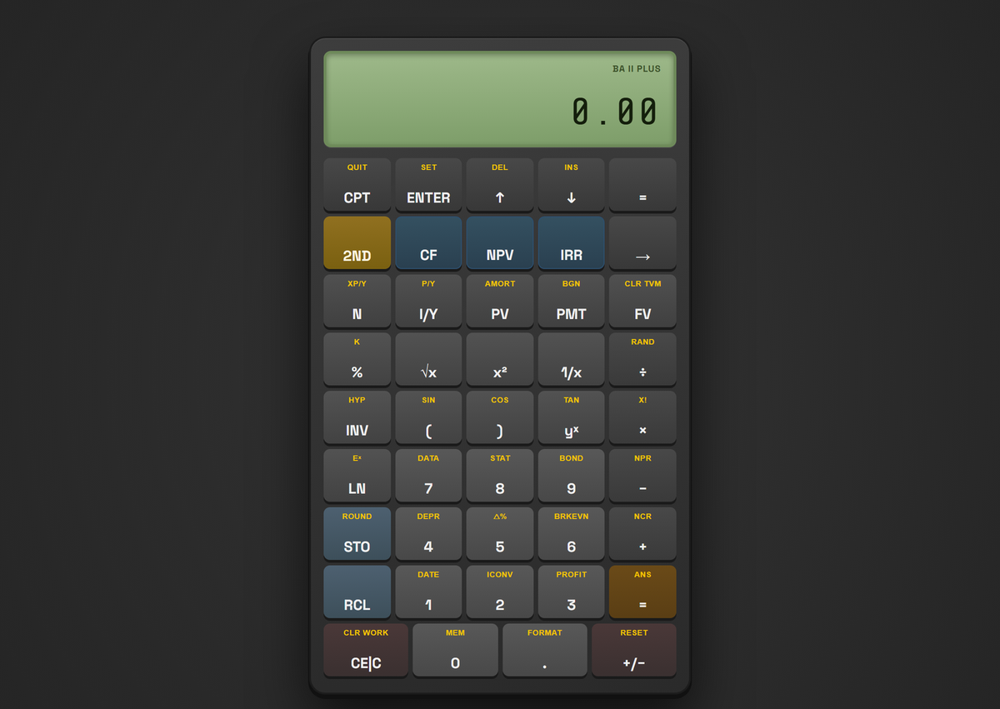
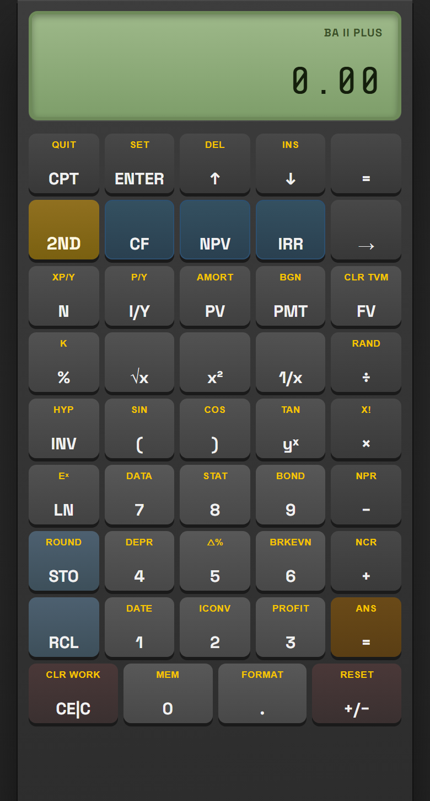

<div align="center">

[English](#readme-en) &nbsp;|&nbsp; [中文](#readme-zh)

</div>

<a id="readme-en"></a>

# BA II Plus Financial Calculator — Offline Edition

A faithful offline copy of the calculator at
[https://baiiplusfinancialcalculator.com/](https://baiiplusfinancialcalculator.com/), bundled into one
self-contained HTML file. Double-click it and the calculator runs — no server, no install, no
network.

**The deliverable is one file: [`BAII_Plus_Financial_Calculator_Offline_2026.html`](BAII_Plus_Financial_Calculator_Offline_2026.html) (199 KB).**

New here and want to change something? Read the **[Engineering Guide](docs/ENGINEERING_GUIDE.md)** —
it covers the pipeline, where each kind of change belongs, and the traps that are not obvious.



---

## Quick start

Download `BAII_Plus_Financial_Calculator_Offline_2026.html` and open it. That is the whole
procedure. It works from a USB stick, an email attachment, a phone's Downloads folder, or a
path with spaces and non-ASCII characters — the file references nothing outside itself.

Verified — not assumed — by [`tools/verify_compatibility.py`](tools/verify_compatibility.py):
identical behaviour on **Chromium, Firefox and WebKit** (the engines behind Chrome/Edge, Firefox
and Safari), under **iPhone, iPad, Pixel and Galaxy** device emulation, and after copying to a
directory whose name contains spaces and non-ASCII characters. No absolute paths anywhere, so it
runs from wherever you put it.



---

## What this is

The original page is a marketing site wrapped around a calculator: navbar, a carousel of other
calculators, five content sections, testimonials, a footer, Google AdSense, Google Tag Manager
and Microsoft Clarity. **Only the calculator was kept.** The other calculators it links to
(`/tvmcalculator`, `/cashflowcalculator`, `/amortizationcalculator`, `/savingscalculator`) are
separate pages and are not included.

Kept:

| Component | What it does |
|---|---|
| LCD display | Main readout, expression line, status indicators |
| Keypad | All 44 keys (9 rows) including the full 2ND layer |
| TVM worksheet | `N` `I/Y` `PV` `PMT` `FV`, plus `P/Y` and `C/Y` |
| Cash flow worksheet | `CF`, `NPV`, `IRR` with per-entry frequency |
| Amortisation | `P1`, `P2`, `BAL`, `PRN`, `INT` |
| Register overlay | `STO` / `RCL` registers 0–9 |
| Format & modes | `DEC`, `DEG`/`RAD`, `US`/`EUR`, `Chn`/`AOS` |

Dropped: navbar, carousel, all marketing sections, footer, every ad and analytics tag.

---

## Fidelity — what matches, and the three things that do not

This was measured against the live site, not assumed. See [Verification](#verification).

**Identical to the live site:**

- `styles.css` and `script.js` are the upstream files unmodified
- Every element upstream ships inside the widget is present, unrewritten
- Which panels open and close, and when
- Calculation results and display output across every mode tested
- Fonts — `Space Grotesk` and `Share Tech Mono` are embedded, not substituted, so the LCD
  renders in the same typeface
- Widget size and horizontal position, to sub-pixel accuracy
- Rendering — pixel-identical within anti-aliasing tolerance

**Deliberately different — three changes:**

1. **The device is centred in the viewport.** Upstream it sits at the top of a long page; with
   everything below it removed, centring is what makes it look like a finished tool rather than
   a page that failed to load.

2. **Worksheet panels sit outside the device, not inside it.** Upstream, opening TVM / CF /
   STO-RCL expands a panel between the display and the keypad, so the device grows downwards and
   pushes the keypad off-screen. Here the panels go to the **left** of the device, top-aligned,
   or **below the whole device** when there is no room beside it. The device itself never moves.

   This is responsive, and switches live as you resize:

   | Window | Panels go |
   |---|---|
   | Landscape, ≥1120px wide | Left of the device; device stays put |
   | Landscape, narrower, or any portrait | Below the whole device; device still stays put |

   The 1120px figure is derived, not guessed: the device is 420px and the page adds 2rem of
   side padding, so a centred device has `(100vw − 32 − 420) / 2` on each side, and a 300px
   panel plus a 20px gap needs 320px a side — 420 + 640 + 32 = 1092, rounded up for slack. Media
   queries re-evaluate on every resize, so dragging the window across the threshold switches
   modes with no JavaScript involved.

   

   

   The CSS lives in [`src/offline_overrides.css`](src/offline_overrides.css) with the reasoning
   documented inline.

3. **`CE|C` is two-stage, like the real device.** This is the only change to how the calculator
   *behaves* rather than how it looks, and it is the one place the offline build knowingly
   disagrees with the live site.

   On the physical BA II Plus the bottom-left key is two functions: press once for **CE** (clear
   the current entry, keep the pending operation), press again for **C** (clear everything).
   Upstream the web version always does the full clear — with `12+` on the display, one press
   discards the `+`, where the real device keeps it.

   | | Upstream | Here |
   |---|---|---|
   | `12 + 5`, press once | `0.00`, `+` gone | `12+0`, `+` kept |
   | then `=` | `0.00` | `12.00` |
   | press again | — | `0.00` |

   Pressing it on an already-clear display does nothing at all — the real device just sits at
   zero, and the engine's two display conventions (a raw expression while typing, a formatted
   number otherwise) must not be allowed to show through as a flicker between `0` and `0.00`.

   A press, any other key, then a press is CE twice, not a C — the pair has to be consecutive.
   `2ND` + the same key is still `CLR WORK`, unchanged, and the worksheet modes (BGN, P/Y,
   FORMAT, AMORT) keep their own behaviour, since they already clear the field you are typing
   into. The keyboard shortcuts `Escape` / `c` follow the same two-stage rule, because
   otherwise they would disagree with the on-screen key.

   This lives in [`src/ce_c_behavior.js`](src/ce_c_behavior.js) — a **separate file**, so
   `script.js` stays byte-for-byte upstream for the second time. It works because `script.js`
   declares its state with top-level `let`/`const`, which in classic scripts live in the shared
   global lexical scope, so a later script can read and write them. It hooks the keypad in the
   capture phase, ahead of the engine's own bubble-phase listener, and suppresses the engine
   only on the press it handles as CE.

**One structural change to the markup.** The three panels are wrapped in a single
`.panel-dock` div, added by the extractor. It is needed because **the panels do not reliably
hide each other**: `openTVM()` and `openCF()` each hide the other two, but `openRegOverlay()`
hides nothing — so pressing `N` and then `STO` leaves the TVM worksheet and the register
overlay open at the same time. Upstream that is harmless: both sit in normal flow and simply
stack down the page. Once positioned, two open panels would land in the same spot and overlap.
The dock gives them a shared column so they stack in DOM order, exactly as upstream.

Nothing else is structural: `script.js` is untouched, and still shows and hides the same panels
in the same circumstances. The parity check unwraps the dock before comparing markup against
the live site, so it still proves everything upstream ships is present and unrewritten.

Two details worth knowing:

- On screens ≤480px the device goes full-bleed, matching upstream's own mobile design. Its
  width there is 358px at a 390px viewport — exactly what the live site uses.
- Panels are positioned rather than in-flow, so they never make the page taller. When one sits
  below the fold the document still scrolls far enough to reach it — verified, not assumed.

---

## Contents

```
BAII_Plus_Financial_Calculator_Offline_2026.html   the deliverable — one self-contained file
│
├── src/                        hand-authored source. The only files you edit by hand.
│   ├── offline_overrides.css   the ONLY authored CSS — read this first
│   └── ce_c_behavior.js        the ONLY change to behaviour: two-stage CE|C
│
├── build/                      generated by the extractor. Disposable — wipe and re-run.
│   ├── page.html               calculator-only page
│   ├── styles.css              upstream, byte-for-byte
│   ├── script.js               upstream, byte-for-byte
│   ├── fonts.css               @font-face sheet, rewritten to local files
│   └── fonts/                  4 woff2 files, 60 KB
│
├── tools/                      the pipeline: fetch -> extract -> build, then verify
│   ├── fetch_upstream.py       mirror the live site into upstream_raw/
│   ├── extract_calculator.py   isolate the widget into build/
│   ├── build_single_file.py    inline everything into the deliverable
│   ├── verify_parity.py        behaviour diff against the live site
│   ├── verify_visual.py        font, geometry and pixel diff against the live site
│   ├── verify_panel_layout.py  worksheet placement and live resize behaviour
│   ├── verify_ce_c.py          two-stage CE|C, the one deliberate behaviour difference
│   ├── verify_compatibility.py paths, cross-engine, mobile, relocation
│   └── check_readme_links.py   every in-document link in this and the guide resolves
│
├── upstream_raw/               pristine mirror of what the live site serves
│
└── docs/
    ├── ENGINEERING_GUIDE.md    how it works and what will bite you (EN, ZH)
    ├── images/                 4 real screenshots, used by both languages
    └── BAIIPlus_Guidebook_*.pdf
```

The `src/` / `build/` split is deliberate. `build/` holds only generated files, so it is
gitignored and safe to delete at any time — the extractor regenerates it from `upstream_raw/`.
Hand-written work lives in `src/`, where nothing will overwrite it. Mixing the two in one
directory means "delete the generated files and rebuild" silently destroys your edits.

`build/page.html` is a normal page — open it directly in a browser while developing; it links
its siblings as plain files and reaches back to `../src/offline_overrides.css`.

---

## Rebuilding

Requires Python 3.10+ (3.11 tested). `Pillow` for the favicon, `playwright` for the verifiers.

```bash
python tools/fetch_upstream.py      # optional — only to re-sync from the live site
python tools/extract_calculator.py  # upstream_raw/ -> build/
python tools/build_single_file.py   # build/ -> the single-file artifact
```

The build is **byte-reproducible**: two consecutive runs produce the same SHA256, on any
platform. Output is written with LF line endings explicitly, so a Windows and a Linux build
agree — which is also why `.gitattributes` pins every text file to LF.

To update from a changed upstream:

```bash
python tools/fetch_upstream.py --force && python tools/extract_calculator.py && python tools/build_single_file.py
```

`fetch_upstream.py` reads the `?v=` cache-busting version out of the page, so a version bump
upstream is picked up automatically rather than silently re-serving a stale copy.

---

<a id="verification"></a>

## Verification

Both harnesses drive the live site and the offline file side by side and compare them. They
need network access for the live half.

```bash
python tools/verify_parity.py        # behaviour
python tools/verify_visual.py        # fonts, geometry, pixels
python tools/verify_panel_layout.py  # worksheet placement (local only, no network)
python tools/verify_ce_c.py          # two-stage CE|C (local only, no network)
python tools/verify_compatibility.py # portability, engines, mobile, relocation (local only)
python tools/check_readme_links.py   # this file's own links (local only, no network)
```

Results at the time of writing:

| Check | Result |
|---|---|
| Widget markup, live vs offline | identical (10,282 chars normalised, dock unwrapped) |
| Behaviour — 24 key sequences, 106 display states | identical |
| `CE|C` (deliberately different) | one press clears the entry, two clears everything |
| Network requests while running all sequences | zero |
| Fonts embedded and applied | both families, metrics match live exactly |
| Widget size and X position (3 viewports) | matches live, ≤0.5px |
| Pixels (3 viewports) | worst 10/255 on 6 pixels; all on the LCD's rounded corners |
| Worksheet placement | left of the device when there is room, below the whole device when there is not |
| Device position while a panel opens | unchanged, to 0.01px, for all three panels |
| TVM + register open together (`N` then `STO`) | both visible, stacked, no overlap |
| Panel below the fold | document scrolls far enough to reach it |
| Panel placement on live resize | switches both ways without a reload |
| Engines — Chromium, Firefox, WebKit | identical display output, 34 states; fonts applied on all three |
| Mobile — iPhone 13 / SE, iPad, Pixel 5, Galaxy S9+ | no horizontal overflow, taps register, fonts load |
| Absolute paths in artifact, sources, tools | none |
| File references vs on-disk spelling | 9/9 exact case (safe on case-sensitive Linux) |
| Filenames legal on Windows, macOS and Linux | 32/32; longest path 74 chars, well under the 260 limit |
| Copied to a sparse, non-ASCII path | identical behaviour, fonts still load |

The 10/255 residual is the browser anti-aliasing a curved edge fractionally differently — it is
below the ~25/255 just-noticeable difference and not visible. The harness fails above 16/255.

`verify_parity.py` presses keys through `element.click()` rather than synthetic mouse events, so
both sides are driven identically and ad or consent overlays on the live page cannot swallow a
press. It then reloads the artifact with every non-`file://` request aborted at the browser
level — if the calculator depended on anything remote, the run would break rather than pass
quietly.

Screenshots land in `.verify_shots/` (gitignored) and are worth opening when a check fails.

---

## Notes

**Source.** Content and code originate from
[baiiplusfinancialcalculator.com](https://baiiplusfinancialcalculator.com/), which hosts this
calculator free and monetises it with ads. All credit for the calculator's design, logic and
ledger behaviour belongs to that site; this repository is an offline packaging of its
calculator, not a reimplementation.

**For personal offline use.** The site's calculator logic and styling are its author's work. If
you intend to republish or use this commercially, ask them first.

**Not affiliated with Texas Instruments.** BA II Plus is TI's trademark; this is an
independent web emulation of it, and so is the upstream site.

---

<div align="center">

[English](#readme-en) &nbsp;|&nbsp; [中文](#readme-zh)

</div>

<a id="readme-zh"></a>

# BA II Plus 金融计算器 — 离线版

把 [https://baiiplusfinancialcalculator.com/](https://baiiplusfinancialcalculator.com/) 上的计算器
完整搬到本地，打包成一个自包含的 HTML 文件。双击即用 —— 不需要服务器、不需要安装、不需要联网。

**成品只有一个文件：[`BAII_Plus_Financial_Calculator_Offline_2026.html`](BAII_Plus_Financial_Calculator_Offline_2026.html)（199 KB）。**

想改动什么？请先读 **[工程指南](docs/ENGINEERING_GUIDE.md)** —— 里面讲了流水线、每类改动该动哪里，
以及那些不那么明显的坑。


---

## 快速开始

下载 `BAII_Plus_Financial_Calculator_Offline_2026.html` 直接打开，就这么简单。放在U盘里、作为邮件附件、
丢进手机下载目录、放在带空格或中文的路径下都能用 —— 这个文件不引用自身之外的任何东西。

由 [`tools/verify_compatibility.py`](tools/verify_compatibility.py) 实测得出，不是口头保证：
在 **Chromium、Firefox、WebKit**（即 Chrome/Edge、Firefox、Safari 的内核）上行为完全一致，
在 **iPhone、iPad、Pixel、Galaxy** 设备模拟下正常，复制到名称含空格与非 ASCII 字符的目录后依然正常。
项目中不存在任何绝对路径，因此放在哪里都能跑。


---

## 这是什么

原网页是一个营销站，计算器只是其中一部分：导航栏、其他计算器轮播、五个内容板块、用户评价、页脚，
外加 Google AdSense、Google Tag Manager、Microsoft Clarity 三套广告与统计脚本。
**这里只保留计算器本身。** 页面上链接的其它计算器（`/tvmcalculator`、`/cashflowcalculator`、
`/amortizationcalculator`、`/savingscalculator`）属于独立页面，未包含在内。

保留的部分：

| 组件 | 作用 |
|---|---|
| LCD 显示屏 | 主显示、表达式行、状态指示 |
| 键盘 | 全部 44 个按键（9 行），含完整 2ND 二级功能 |
| TVM 工作表 | `N` `I/Y` `PV` `PMT` `FV`，以及 `P/Y`、`C/Y` |
| 现金流工作表 | `CF`、`NPV`、`IRR`，支持逐项设置频次 |
| 摊销 | `P1`、`P2`、`BAL`、`PRN`、`INT` |
| 寄存器面板 | `STO` / `RCL` 寄存器 0–9 |
| 格式与模式 | `DEC`、`DEG`/`RAD`、`US`/`EUR`、`Chn`/`AOS` |

已去除：导航栏、轮播、全部营销板块、页脚、所有广告与统计脚本。

---

## 还原度 —— 哪些一致，以及仅有的三处不一致

以下结论都是跟线上网站实测对比得出的，不是推测。详见[验证](#verification-zh)。

**与线上完全一致：**

- `styles.css` 与 `script.js` 为上游原文件，未作任何改动
- 上游放在组件里的每一个元素都还在，且未被改写
- 哪些面板在什么情况下打开、关闭
- 所有已测模式下的计算结果与显示输出
- 字体 —— `Space Grotesk` 与 `Share Tech Mono` 是内嵌的，不是替代字体，LCD 显示的是同一种字形
- 计算器尺寸与水平位置，亚像素级一致
- 渲染效果 —— 在抗锯齿容差内像素级一致

**有意为之的差异 —— 三处：**

1. **计算器在视口内垂直居中。** 线上它位于长页面顶部；下方内容全部移除后，居中才能让它看起来像
   一个完整的工具，而不是一个没加载完的页面。

2. **工作表面板在计算器外部，而不是内部。** 线上打开 TVM / CF / STO-RCL 时，面板会插在显示屏和
   键盘之间，把键盘往下挤。这里改为放在计算器**左侧**、与其顶部对齐；放不下时则放在**整个计算器
   的下方**。计算器本身始终原地不动。

   这个布局是响应式的，拖动窗口时会实时切换：

   | 窗口情况 | 面板位置 |
   |---|---|
   | 横屏且宽度 ≥1120px | 计算器左侧，计算器原地不动 |
   | 横屏但更窄，或任何竖屏 | 整个计算器的下方，计算器依然原地不动 |

   1120px 这个阈值是算出来的，不是拍的：计算器宽 420px，页面左右各 1rem 内边距，因此居中的
   计算器左右各有 `(100vw − 32 − 420) / 2` 的空间；300px 的面板加 20px 间距需要一侧 320px，
   即 420 + 640 + 32 = 1092，向上取整留些余量。媒体查询在每次尺寸变化时都会重新求值，因此拖动
   窗口跨越阈值时会实时切换，完全不涉及 JavaScript。

   

   

   CSS 写在 [`src/offline_overrides.css`](src/offline_overrides.css) 中，文件内注明了理由。

3. **`CE|C` 改为两段式，与真机一致。** 这是唯一一处改变计算器**行为**（而非外观）的改动，
   也是离线版唯一一处有意与线上网站不一致的地方。

   真机 BA II Plus 上，左下角那个键承载两个功能：按一次是 **CE**（清除当前输入，保留未完成的
   运算），再按一次是 **C**（全部清除）。线上网页版永远是全清 —— 显示 `12+` 时按一次就把 `+`
   丢掉了，而真机会保留。

   | 操作 | 线上 | 本离线版 |
   |---|---|---|
   | 输入 `12 + 5`，按一次 | `0.00`，`+` 被丢弃 | `12+0`，`+` 保留 |
   | 接着按 `=` | `0.00` | `12.00` |
   | 再按一次 | — | `0.00` |

   在已经清空的界面上按它不会有任何变化 —— 真机就是停在 0 不动；而引擎有两套显示约定
   （输入过程中显示原始表达式、其余情况显示格式化数字），不能让两者的差异表现为 `0` 与 `0.00`
   之间来回闪烁。

   按一次、中间按了别的键、再按一次，算两次 CE 而不是一次 C —— 必须是连续两次才算。
   `2ND` + 同一个键仍然是 `CLR WORK`，未作改动；各工作表模式（BGN、P/Y、FORMAT、AMORT）保持
   原有行为，因为它们本来就只清除你正在输入的那个字段。键盘快捷键 `Escape` / `c` 遵循同样的
   两段式规则，否则会和屏幕上的按键行为不一致。

   实现放在 [`src/ce_c_behavior.js`](src/ce_c_behavior.js) —— 一个**独立文件**，因此
   `script.js` 第二次保持了与上游逐字节一致。能做到这一点是因为 `script.js` 用顶层
   `let`/`const` 声明状态，而在传统脚本中这些位于共享的全局词法作用域，后续脚本可以读写它们。
   它在捕获阶段挂载到键盘上，早于引擎自己的冒泡阶段监听器，并且只在自己处理的那一次（CE）上
   阻止事件继续传递。

**一处结构性改动。** 三个面板被包进一个 `.panel-dock` 容器，由提取脚本添加。之所以需要它，是因为
**这三个面板并不会可靠地互相隐藏**：`openTVM()` 和 `openCF()` 都会关掉另外两个，但
`openRegOverlay()` 什么都不关 —— 所以先按 `N` 再按 `STO`，TVM 工作表和寄存器面板会同时打开。
线上这没问题：两者都在正常文档流里，直接往下堆叠即可。但一旦改成定位布局，两个同时打开的面板就会
落在同一个位置而重叠。这个容器给它们一列共用的空间，让它们按 DOM 顺序堆叠，与线上表现一致。

除此之外没有任何结构性改动：`script.js` 未作改动，面板的显示与隐藏时机与线上完全一致。行为对比
脚本会在比对前先把这个容器"拆掉"，因此仍然能证明上游组件里的每个元素都存在且未被改写。

两个值得注意的细节：

- 屏幕宽度 ≤480px 时，计算器变为全宽铺满，这与上游自己的移动端设计一致。在 390px 视口下宽度为
  358px —— 和线上完全相同。
- 面板是定位而非文档流布局，因此不会撑高页面。当面板位于首屏之外时，页面依然能滚动到它 ——
  这一点是实测验证过的，不是想当然。

---

## 目录结构

```
BAII_Plus_Financial_Calculator_Offline_2026.html   成品 —— 单个自包含文件
│
├── src/                        手写源码。整个项目只有这里需要手动编辑。
│   ├── offline_overrides.css   唯一手写的 CSS —— 建议先读这个
│   └── ce_c_behavior.js        唯一改变行为的文件：两段式 CE|C
│
├── build/                      由提取脚本生成。可随时删除重建。
│   ├── page.html               仅含计算器的页面
│   ├── styles.css              上游原文件，逐字节一致
│   ├── script.js               上游原文件，逐字节一致
│   ├── fonts.css               @font-face 表，已改写为指向本地文件
│   └── fonts/                  4 个 woff2 文件，60 KB
│
├── tools/                      流水线：抓取 -> 提取 -> 构建，以及验证脚本
│   ├── fetch_upstream.py       把线上站点镜像到 upstream_raw/
│   ├── extract_calculator.py   提取出计算器到 build/
│   ├── build_single_file.py    内联所有资源，产出成品
│   ├── verify_parity.py        与线上逐键对比行为
│   ├── verify_visual.py        与线上对比字体、几何与像素
│   ├── verify_panel_layout.py  检查工作表面板位置与拖动窗口时的实时切换
│   ├── verify_ce_c.py          两段式 CE|C，唯一一处有意的行为差异
│   ├── verify_compatibility.py 路径、跨浏览器、移动端、换位置后的可用性
│   └── check_readme_links.py   检查本文档与工程指南内所有跳转链接
│
├── upstream_raw/               线上资源的原始镜像
│
└── docs/
    ├── ENGINEERING_GUIDE.md    工程介绍与工作流（英文、中文）
    ├── images/                 4 张实机截图，中英文共用同一组
    └── BAIIPlus_Guidebook_*.pdf
```

`src/` 与 `build/` 的划分是有意为之。`build/` 里只有生成的文件，因此被 gitignore，
可以随时整个删掉 —— 提取脚本会从 `upstream_raw/` 重新生成。手写的内容放在 `src/`，
不会被任何脚本覆盖。若把两者混在同一个目录里，"删掉生成文件重新构建"就会悄无声息地
删掉你手写的改动。

`build/page.html` 是一个正常网页，开发时可直接用浏览器打开，它以普通文件方式引用同级资源，
并通过相对路径引用 `../src/offline_overrides.css`。

---

## 重新构建

需要 Python 3.10+（实测 3.11）。生成图标需要 `Pillow`，验证脚本需要 `playwright`。

```bash
python tools/fetch_upstream.py      # 可选 —— 仅在需要重新同步线上资源时运行
python tools/extract_calculator.py  # upstream_raw/ -> build/
python tools/build_single_file.py   # src/ -> 单文件成品
```

构建是**可字节复现**的：连续两次构建产生相同的 SHA256，且与平台无关。输出显式使用 LF 换行，
因此 Windows 与 Linux 的构建结果一致 —— 这也是 `.gitattributes` 把所有文本文件锁定为 LF 的原因。

线上更新后重新同步：

```bash
python tools/fetch_upstream.py --force && python tools/extract_calculator.py && python tools/build_single_file.py
```

`fetch_upstream.py` 会从页面里读取 `?v=` 版本号，因此上游版本号变更会被自动识别，而不是悄悄沿用旧文件。

---

<a id="verification-zh"></a>

## 验证

两个脚本都会同时驱动线上站点和离线文件并对比。线上部分需要联网。

```bash
python tools/verify_parity.py        # 行为
python tools/verify_visual.py        # 字体、几何、像素
python tools/verify_panel_layout.py  # 工作表面板位置（纯本地，无需联网）
python tools/verify_ce_c.py          # 两段式 CE|C（纯本地，无需联网）
python tools/verify_compatibility.py # 路径可移植性、浏览器、移动端、换位置（纯本地）
python tools/check_readme_links.py   # 本文档自身的跳转链接（纯本地，无需联网）
```

当前结果：

| 检查项 | 结果 |
|---|---|
| 计算器 DOM 结构，线上 vs 离线 | 完全一致（规范化后 10,282 字符，比对前先拆掉 dock 容器） |
| 行为 —— 24 组按键序列、106 个显示状态 | 完全一致 |
| `CE|C`（有意不同） | 按一次清除输入，连按两次全部清除 |
| 跑完所有序列期间发起的网络请求 | 0 次 |
| 字体是否内嵌并生效 | 两套字体均生效，度量与线上完全一致 |
| 计算器尺寸与 X 坐标（3 种视口） | 与线上一致，误差 ≤0.5px |
| 像素（3 种视口） | 最差 6 个像素差 10/255，全部位于 LCD 圆角处 |
| 工作表面板位置 | 放得下时在计算器左侧，放不下时在整个计算器下方 |
| 打开面板时计算器的位移 | 三个面板均为 0，精度 0.01px |
| TVM 与寄存器面板同时打开（`N` 后按 `STO`） | 两者均可见、堆叠、不重叠 |
| 面板位于首屏之外时 | 页面可滚动到该面板 |
| 拖动窗口时的面板位置 | 来回切换均正常，无需刷新 |
| 浏览器 —— Chromium、Firefox、WebKit | 显示输出完全一致（34 个状态）；三者字体均生效 |
| 移动端 —— iPhone 13 / SE、iPad、Pixel 5、Galaxy S9+ | 无横向溢出、点击有效、字体加载正常 |
| 成品 / 源码 / 脚本中的绝对路径 | 无 |
| 文件引用与实际文件名拼写 | 9/9 大小写完全一致（可安全复制到区分大小写的 Linux） |
| 文件名在 Windows / macOS / Linux 上合法 | 32/32；最长路径 74 字符，远低于 260 上限 |
| 复制到含空格与非 ASCII 的路径 | 行为完全一致，字体正常加载 |

这 10/255 的残差来自浏览器对曲线边缘的抗锯齿处理存在细微差别 —— 低于约 25/255 的可察觉阈值，
肉眼不可见。脚本在超过 16/255 时会判定失败。

`verify_parity.py` 通过 `element.click()` 而不是模拟鼠标事件按键，这样两端驱动方式完全一致，
线上页面的广告或同意弹窗也不会吞掉按键。随后它会在浏览器层面拦截并中止所有非 `file://` 请求后
重新加载成品 —— 如果计算器依赖了任何远程资源，测试会直接失败而不是悄悄通过。

截图输出到 `.verify_shots/`（已在 gitignore 中），检查失败时值得打开看看。

---

## 说明

**来源。** 内容与代码来自 [baiiplusfinancialcalculator.com](https://baiiplusfinancialcalculator.com/)，
该站免费提供此计算器并以广告变现。计算器的设计、逻辑与运算行为的全部功劳归该站点所有；
本仓库只是对其计算器的离线打包，不是重新实现。

**供个人离线使用。** 站点的计算逻辑与样式属于原作者。如需转载或商用，请先取得对方许可。

**与德州仪器无关。** BA II Plus 是 TI 的商标；本站点是它的第三方网页模拟实现，上游站点同样如此。
