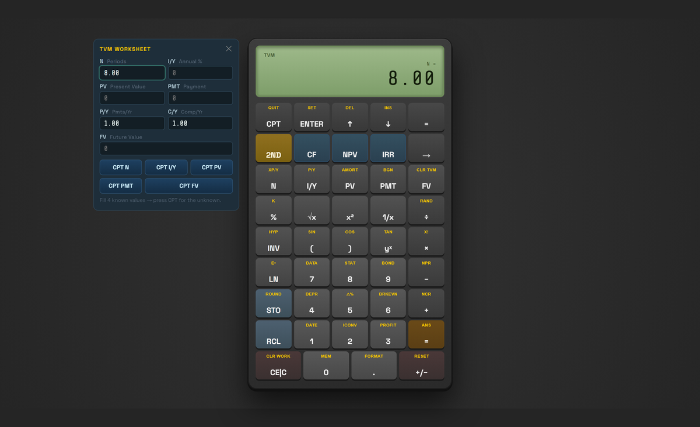
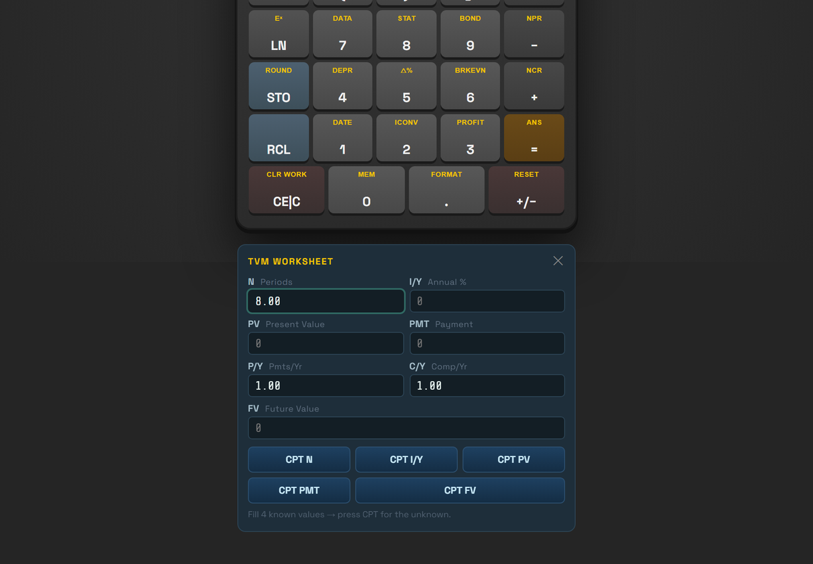

<div align="center">

[English](#guide-en) &nbsp;|&nbsp; [中文](#guide-zh)

</div>

<a id="guide-en"></a>

# Engineering Guide

Everything needed to reproduce this project, change it safely, or improve it — written for a
developer or an AI agent starting cold. The [README](../README.md) explains what the project
*is*; this explains how it *works* and what will bite you.

**Read [Traps](#traps) before changing anything.** Several of them cost real debugging time and
none are obvious from the code.

---

## 1. The one-paragraph summary

The live site `baiiplusfinancialcalculator.com` is a marketing page wrapped around a
client-side calculator. This project extracts just the calculator and packages it as a single
self-contained HTML file. `styles.css` and `script.js` are the upstream files **byte-for-byte**;
the calculator's engine is never edited by hand. Everything this project adds is either a
styling override or one of two small behaviour patches, and all three live in marked files.

---

## 2. Orientation — five minutes

```bash
git clone <repo> && cd BA_II_Plus_Financial_Calculator
python tools/extract_calculator.py   # upstream_raw/ -> build/
python tools/build_single_file.py    # build/ -> the artifact
# open BAII_Plus_Financial_Calculator_Offline_2026.html
```

Nothing to install for that path beyond Python 3.10+. The deliverable is a static file; there is
no server, no package manager, no bundler.

To run the checks you also need `pip install playwright pillow` and
`python -m playwright install chromium firefox webkit`.

| I want to… | Go to |
|---|---|
| Change how it looks | [`src/offline_overrides.css`](../src/offline_overrides.css) |
| Change how it behaves | [`src/ce_c_behavior.js`](../src/ce_c_behavior.js) |
| Change focus / input behaviour | [`src/panel_focus.js`](../src/panel_focus.js) |
| Understand the pipeline | [§3 Architecture](#3-architecture) — the stage table |
| Know what was changed from upstream | [§5 Deliberate deviations](#5-deliberate-deviations) |
| Know why a check exists | [§6 Verification](#6-verification) |
| Avoid a nasty surprise | [§7 Traps](#7-traps) |

---

## 3. Architecture

Three stages, one script each, plus a verification layer that sits outside the build.

| Stage | Script | Reads | Writes |
|---|---|---|---|
| 1. Mirror | `fetch_upstream.py` | the live site (network) | `upstream_raw/` |
| 2. Extract | `extract_calculator.py` | `upstream_raw/` + `src/` | `build/` |
| 3. Bundle | `build_single_file.py` | `build/` + `src/` | the artifact |

Stage 1 is optional after the first run — `upstream_raw/` is committed, so a clone builds with
no network at all. That is deliberate: it makes the build reproducible and lets the whole thing
be audited offline.

### Directory contract

```
src/            hand-written. Nothing generated ever lands here.
build/          generated. gitignored. Safe to delete at any time.
upstream_raw/   the mirror. Treat as read-only; only fetch_upstream.py writes it.
tools/          the pipeline and the verifiers.
docs/           this guide, the diagrams, the TI guidebook PDFs.
```

The `src/` / `build/` split is load-bearing, not tidiness. An earlier revision wrote generated
files into `src/`, and "delete the generated files and rebuild" silently deleted the one
hand-written stylesheet. **Keep the contract**: if you add a generated file, it goes in
`build/`; if you add a file a human edits, it goes in `src/`.

### Why the artifact is trustworthy

`script.js` and `styles.css` are copied with `write_bytes` and never parsed, so they are the
same bytes the site serves. `verify_ce_c.py` and the build both assume this; you can confirm it
in one command:

```bash
cmp upstream_raw/script.js build/script.js && echo "verbatim"
```

---

## 4. Data flow inside the calculator

Worth knowing before you touch behaviour. `script.js` is a classic script, not a module. Its
state lives in top-level `let`/`const`, which in a classic script go into the **shared global
lexical scope** — visible to any script that loads afterwards.

| Name | Holds |
|---|---|
| `expression` | the whole expression as a string, e.g. `"12+5"`, `"2+3*"` |
| `currentMode` | `"standard"` · `"bgn"` · `"amort"` · `"py"` · `"format"` |
| `calcMode` | `"Chn"` (chain) or `"AOS"` (algebraic) |
| `is2nd` | whether the 2ND layer is armed |
| `MEM[10]` | the STO/RCL registers |
| `pendingOp` | **only** `'sto'`/`'rcl'` — *not* arithmetic operators |

Two display conventions coexist, and confusing them causes visible bugs:

- `setScreen(expression)` — the raw string, used while the user is typing
- `setScreen(fmt(n))` — a formatted number (`"0.00"`, thousands separators), used otherwise

`fmt(0)` is `"0.00"` but the raw expression for an empty entry is `"0"`. Same state, two
spellings. Anything that renders "cleared" must pick the same one the engine does, or the
readout flickers between them. `check` this if you ever touch CE|C or any reset path.

---

## 5. Deliberate deviations

Everything here is intentional. Do not "fix" these back to upstream behaviour without reading
why first.

### 5.1 Layout — `src/offline_overrides.css` (authored)

Three changes, all in this one file. Delete it from the build and you get upstream's layout back
exactly.

1. **The device is centred in the viewport.** Upstream it sits at the top of a long page;
   with everything below removed, centring is what makes it look finished.
2. **Worksheet panels are positioned outside the device** — left when there is room (landscape
   and ≥1120px), below the whole device otherwise. Upstream they expand *between* the display
   and the keypad, pushing the keypad off-screen. The device never moves.
3. Phones (≤480px) keep upstream's full-bleed design; only the hero padding is trimmed.

The 1120px threshold is derived, not chosen: `420 (device) + 2 × (300 panel + 20 gap) + 32 padding
= 1092`, rounded up for slack. If you change the panel width, recompute it.





Centring uses `justify-content: safe center`. That is not decoration: with a worksheet open the
device is ~1088px tall and overflows a 768px laptop screen, and plain `center` would push the
top out of the scroll origin where it cannot be reached.

### 5.2 The panel dock — one structural change, made by the extractor

`extract_calculator.py` wraps the three panels in `<div class="panel-dock">`. This is the only
change to the widget's markup.

It exists because **the panels do not reliably hide each other**: `openTVM()` and `openCF()` each
hide the other two, but `openRegOverlay()` hides nothing. Pressing `N` then `STO` genuinely
leaves two panels open at once. Upstream that is harmless — both sit in normal flow and stack
down the page — but once positioned they would land in the same spot and overlap. The dock gives
them a shared flex column so they stack in DOM order, exactly as upstream does.

`wrap_panels()` asserts the wrapped run contains all three panels and neither the display nor
the keypad, so an upstream reshuffle fails the build instead of silently wrapping the wrong
markup.

### 5.3 Two-stage CE|C — `src/ce_c_behavior.js` (authored)

The only change to how the calculator **behaves**, and the only place this build knowingly
disagrees with the live site.

A real BA II Plus clears the current *entry* on the first press of `CE|C` and everything on the
second. Upstream always clears everything. See [README §Fidelity](../README.md#fidelity--what-matches-and-the-three-things-that-do-not)
for the behaviour table.

**Why it is a separate file.** `script.js` must stay byte-for-byte upstream so an upstream
re-sync is a clean diff and the engine is never hand-edited. The patch reaches the engine through
the shared global lexical scope described in §4, and hooks the keypad **in the capture phase** —
the engine listens on `#keypad` in the bubble phase, so a capture listener on the same element
runs first and `stopPropagation()` keeps the engine from seeing the press.

Three details that are easy to break:

- **Type-over.** CE leaves an explicit `0`; the next digit must *replace* it, not append. Without
  this, `12+0` plus `4` becomes `12+04`. In AOS that is not cosmetic — see [§7.1](#71-strict-mode-rejects-04).
- **`2ND` + the key is `CLR WORK`** and must never be intercepted. The patch returns early when
  `is2nd` is set.
- **Worksheet modes are left alone.** `bgn` / `py` / `format` / `amort` already clear the field
  being typed into, which is the CE half already; their second press exits the worksheet.
  Overriding them would break navigation.

### 5.4 No focus stealing — `src/panel_focus.js` (authored)

`script.js` focuses a panel input from three places, each immediately after opening a panel:
line 988 (the `N` / `I/Y` / `PV` / `PMT` keys), line 1021 (the `FV` key) and line 1062 (the `NPV`
key, on `#cfRate`). On a desktop that is a convenience. On a phone it is destructive: the panel
sits below the device, so focusing scrolls it into view — animated, because `styles.css` sets
`scroll-behavior: smooth` — and the virtual keyboard covers what is left, hiding the calculator
the user is typing on.

The patch shadows `focus` on the panel inputs. A tap or click is handled by the browser's own
default action and never calls that method, so tapping still focuses the field and still raises
the keyboard. Nothing in the engine reads `document.activeElement` or uses a selection API, so
the only thing lost is the automatic caret placement.

The STO/RCL overlay has no inputs and was never affected.

---

## 6. Verification

Six harnesses. Each exits non-zero on failure, and none of them are optional if you change
anything — the failure modes here are silent (a dead link, a flickering readout, a font that
falls back without changing a single character of text).

| Script | Proves | Network |
|---|---|---|
| `verify_parity.py` | Behaviour and markup still match the live site — 24 sequences, 106 display states | yes |
| `verify_visual.py` | Fonts embedded and applied; size, position and pixels match live | yes |
| `verify_panel_layout.py` | Panels outside the device, stacked not overlapping, device pinned, live resize | no |
| `verify_ce_c.py` | The two-stage CE|C, and that worksheets and `CLR WORK` are untouched | no |
| `verify_panel_focus.py` | No panel steals focus or scrolls the page on open; tapping a field still focuses it | no |
| `verify_compatibility.py` | Portable paths; works on Chromium/Firefox/WebKit and 5 mobile devices; runs after relocation | no |
| `check_readme_links.py` | Every in-document link in the README resolves | no |

Run everything:

```bash
for t in verify_parity verify_visual verify_panel_layout verify_ce_c \
         verify_compatibility check_readme_links; do python tools/$t.py || break; done
```

Two design notes worth preserving if you edit these:

- **CE|C is excluded from `verify_parity.py` on purpose.** That harness asserts the two builds
  agree, and CE|C is the one thing meant to differ. It resets between sequences by pressing until
  the display reads `0.00` — a fixed number of presses cannot work, because which press lands as
  *C* depends on whether 2ND happened to be pending. Its markup check blanks the LCD readouts
  first, since those are state, not structure.
- **`verify_visual.py` neutralises the live-only navbar and the background gradient before
  comparing pixels.** Without that it measures the page chrome and the repositioned gradient
  rather than the widget.

---

<a id="traps"></a>

## 7. Traps

### 7.1 Strict mode rejects `04`

AOS evaluation uses `Function('"use strict"; return (' + expression + ')')`. In strict mode
`04` is a legacy octal literal and therefore a **SyntaxError** — the display shows `Error`, not a
wrong number. Anything that can produce a leading zero in an entry (`04`, `07`) breaks AOS only,
so a Chn-only test will not catch it. This is why CE|C does type-over.

### 7.2 `networkidle` never fires on the live page

The live site runs Tag Manager, AdSense and Clarity, which poll continuously, so the network
never goes idle and `wait_until="networkidle"` times out at random. Use `domcontentloaded` plus
an explicit `wait_for_selector("#calculator")`. Both live harnesses do this.

### 7.3 `write_text()` silently converts line endings

`Path.write_text()` translates `\n` to `os.linesep`, so a Windows build emits CRLF and a Linux
build LF — different bytes for identical input, and a non-reproducible artifact. Every generator
here passes `newline="\n"` explicitly, and `.gitattributes` pins all text files to LF.

### 7.4 Windows is case-insensitive, Linux is not

A reference to `Styles.css` works on Windows and 404s on Linux. `verify_compatibility.py` part A2
checks every reference against the on-disk spelling. Filenames are also checked for characters
and names that are illegal on Windows, macOS or Linux.

### 7.5 Google Fonts serves a different sheet to unknown clients

The default Python user-agent gets a legacy TTF sheet. `fetch_upstream.py` sends a desktop Chrome
UA to get the woff2 sheet the page actually uses. Fonts must then be **inlined as base64** — the
LCD uses `Share Tech Mono`, and a silent fallback changes its appearance without changing any
text, so it cannot be caught by comparing strings.

### 7.6 Google serves the same variable font once per weight

A `wght@400;500;600;700` request returns 13 `@font-face` blocks pointing at only 4 files. Space
Grotesk is a variable font (`fvar` axis 300–700), so the four weight blocks per subset are the
same binary. Inlining as served embeds each file four times over — 205KB of base64 instead of
61KB. `build_fonts_css()` merges them into one face with a weight range.

### 7.7 Deleting `src/` deletes only hand-written work

An earlier revision had generated output in `src/`. `rm -rf src && rebuild` destroyed
`offline_overrides.css` and nothing regenerated it. Hence the `src/` / `build/` split in §3.

---

## 8. Git workflow

Gitflow: `main` holds tagged releases, `develop` integrates, work happens on a branch and merges
with `--no-ff` so the feature history survives.

```
main      ──●──────────────●──────────────●──      tagged v1.0.0, v1.1.0, …
             ╲            ╱ ╲            ╱
develop       ●──●──●──●──   ●──●──●──●──          integration
                 ╲  ╱           ╲  ╱
feature/…         ●●             ●●                one branch per change
```

```bash
git checkout develop && git checkout -b feature/my-change
# … commit …
git checkout develop && git merge --no-ff feature/my-change
git checkout -b release/v1.3.0 develop
git checkout main && git merge --no-ff release/v1.3.0 && git tag -a v1.3.0
git checkout develop && git merge --no-ff main    # back-merge
```

**Commit messages explain *why*.** Several traps above are recorded in the commit that fixed
them; that history is the reason they are not re-introduced.

---

## 9. Making a change — where does it go?

| Change | Where | Then |
|---|---|---|
| Colours, spacing, font size | `src/offline_overrides.css` | `build_single_file.py`, `verify_visual.py` |
| Panel placement or its threshold | `src/offline_overrides.css` | `verify_panel_layout.py` |
| Calculator behaviour | `src/ce_c_behavior.js` | `verify_ce_c.py` |
| Focus, or anything a panel does to the page on open | `src/panel_focus.js` | `verify_panel_focus.py` |
| Which markup survives extraction | `tools/extract_calculator.py` | rebuild; `verify_parity.py` |
| Pull a newer upstream | `python tools/fetch_upstream.py --force` | full pipeline + both live harnesses |

Never edit `build/` (regenerated) or `upstream_raw/` (the mirror). If you find yourself wanting
to edit `script.js`, re-read §5.3 — a separate file has worked twice.

---

## 10. Glossary

| Term | Meaning |
|---|---|
| **the device** | the calculator body itself — `<div id="calculator">` |
| **the dock** | `.panel-dock`, the flex column holding the three worksheet panels |
| **worksheet panel** | TVM, cash flow, or the STO/RCL register overlay |
| **CLR WORK** | `2ND` + `CE|C`. Upstream behaviour, untouched |
| **CLR TVM** | `2ND` + `FV`. Clears the TVM variables |
| **Chn / AOS** | chain vs algebraic evaluation order |
| **the artifact** | `BAII_Plus_Financial_Calculator_Offline_2026.html`, the deliverable |

---

## 11. Provenance and licence

The calculator's design, logic and styling are the work of
[baiiplusfinancialcalculator.com](https://baiiplusfinancialcalculator.com/), which hosts it free
and monetises it with ads. This repository is an offline packaging for personal use, **not a
reimplementation**, and the author's rights are unaffected.

Not affiliated with Texas Instruments. BA II Plus is TI's trademark; both this and the upstream
site are independent web emulations of it.

---

<div align="center">

[English](#guide-en) &nbsp;|&nbsp; **中文**

</div>

<a id="guide-zh"></a>

# 工程指南

复现、安全改动、改进这个项目所需的全部内容 —— 面向冷启动的开发者或 AI agent。
[README](../README.md) 讲这个项目**是什么**，本文讲它**怎么运作**，以及哪些地方会坑到你。

**动手前请先读[陷阱](#traps-zh)。** 其中几条是实际调试出来的，从代码上完全看不出来。

---

## 1. 一句话概括

线上站点 `baiiplusfinancialcalculator.com` 是一个营销页面套一个纯前端计算器。本项目只把计算器
抽出来，打包成一个自包含的 HTML 文件。`styles.css` 与 `script.js` 是上游文件的**逐字节副本**，
计算器引擎从不手动编辑。本项目新增的内容只有三类：样式覆盖与两处行为补丁，且都在明确标注的文件里。

---

## 2. 五分钟上手

```bash
git clone <repo> && cd BA_II_Plus_Financial_Calculator
python tools/extract_calculator.py   # upstream_raw/ -> build/
python tools/build_single_file.py    # build/ -> 成品
# 打开 BAII_Plus_Financial_Calculator_Offline_2026.html
```

这条路径除 Python 3.10+ 外无需安装任何东西。成品是静态文件：没有服务端、没有包管理器、没有打包器。

跑检查还需要 `pip install playwright pillow` 与 `python -m playwright install chromium firefox webkit`。

| 我想…… | 去哪 |
|---|---|
| 改外观 | [`src/offline_overrides.css`](../src/offline_overrides.css) |
| 改行为 | [`src/ce_c_behavior.js`](../src/ce_c_behavior.js) |
| 改焦点 / 输入行为 | [`src/panel_focus.js`](../src/panel_focus.js) |
| 理解流水线 | [§3 架构](#3-架构) —— 阶段对照表 |
| 知道改了上游哪些东西 | [§5 有意为之的偏离](#5-有意为之的偏离) |
| 知道某个检查为什么存在 | [§6 验证](#6-验证) |
| 避开坑 | [§7 陷阱](#traps-zh) |

---

## 3. 架构

三个阶段，每个阶段一个脚本，外加一层独立于构建之外的验证。

| 阶段 | 脚本 | 读取 | 写出 |
|---|---|---|---|
| 1. 镜像 | `fetch_upstream.py` | 线上站点（需联网） | `upstream_raw/` |
| 2. 提取 | `extract_calculator.py` | `upstream_raw/` + `src/` | `build/` |
| 3. 打包 | `build_single_file.py` | `build/` + `src/` | 成品 |

第一次跑完之后阶段 1 就是可选的 —— `upstream_raw/` 已提交进仓库，因此 clone 下来完全不用联网就能构建。
这是有意为之：让构建可复现，也让整个项目能离线审计。

### 目录约定

```
src/            手写内容。生成的产物永远不会落在这里。
build/          生成物。已 gitignore，随时可以整个删掉。
upstream_raw/   镜像。视为只读，只有 fetch_upstream.py 会写它。
tools/          流水线与验证脚本。
docs/           本指南、图示、TI 使用手册 PDF。
```

`src/` 与 `build/` 的划分是**承重结构**，不是为了整齐。早期版本把生成物写进 `src/`，
结果"删掉生成文件重新构建"就把唯一手写的样式表也一起删了。**请守住这个约定**：
生成的文件放 `build/`，需要人编辑的文件放 `src/`。

### 成品为什么可信

`script.js` 与 `styles.css` 用 `write_bytes` 原样复制、从不解析，因此与站点提供的字节完全一致。
一条命令即可自证：

```bash
cmp upstream_raw/script.js build/script.js && echo "逐字节一致"
```

---

## 4. 计算器内部的数据流

动手改行为之前需要了解。`script.js` 是传统脚本而非模块。它的状态放在顶层 `let`/`const`，
在传统脚本中这些位于**共享的全局词法作用域** —— 之后加载的任何脚本都能看到。

| 名称 | 内容 |
|---|---|
| `expression` | 整个表达式字符串，例如 `"12+5"`、`"2+3*"` |
| `currentMode` | `"standard"` · `"bgn"` · `"amort"` · `"py"` · `"format"` |
| `calcMode` | `"Chn"`（链式）或 `"AOS"`（代数） |
| `is2nd` | 2ND 二级功能是否已激活 |
| `MEM[10]` | STO/RCL 寄存器 |
| `pendingOp` | **仅**用于 `'sto'`/`'rcl'` —— **不是**算术运算符 |

同时存在两套显示约定，混淆它们会产生肉眼可见的 bug：

- `setScreen(expression)` —— 原始字符串，用户输入过程中使用
- `setScreen(fmt(n))` —— 格式化数字（`"0.00"`、千分位），其余情况使用

`fmt(0)` 是 `"0.00"`，而空输入的原始表达式是 `"0"`。同一个状态、两种拼法。
任何渲染"已清空"的代码都必须和引擎选同一种，否则读数会在两者之间闪烁。
改动 CE|C 或任何重置路径时请留意这一点。

---

## 5. 有意为之的偏离

以下全部是有意为之。未经阅读缘由，不要把它们"修"回上游行为。

### 5.1 布局 —— `src/offline_overrides.css`（手写）

三处改动，全在这一个文件里。把它从构建中移除，即可完全恢复上游布局。

1. **计算器在视口内垂直居中。** 线上它位于长页面顶部；下方内容移除后，居中才能让它看起来完整。
2. **工作表面板定位在计算器外部** —— 放得下时在左侧（横屏且 ≥1120px），否则在整个计算器下方。
   线上它们是插在显示屏和键盘**之间**展开的，会把键盘挤出屏幕。计算器本身不动。
3. 手机（≤480px）保留上游的全宽铺满设计，只是裁掉了 hero 内边距。

1120px 这个阈值是算出来的，不是拍的：`420（计算器）+ 2 ×（300 面板 + 20 间距）+ 32 内边距 = 1092`，
向上取整留余量。若改动面板宽度，请重新计算。


居中用的是 `justify-content: safe center`，这不是装饰：打开工作表后计算器高约 1088px，
会超出 768px 的笔记本屏幕，用普通的 `center` 会把顶部推到滚动起点之上，导致够不到。

### 5.2 面板容器 —— 由提取脚本完成的唯一一处结构性改动

`extract_calculator.py` 把三个面板包进 `<div class="panel-dock">`。这是对组件标记的唯一改动。

它之所以存在，是因为**三个面板并不会可靠地互相隐藏**：`openTVM()` 和 `openCF()` 都会关掉另外两个，
但 `openRegOverlay()` 什么都不关。先按 `N` 再按 `STO` 确实会同时打开两个面板。线上这没问题 ——
两者都在正常文档流里往下堆叠 —— 但改成定位后它们会落在同一位置而重叠。这个容器给它们一列共用的
flex 空间，让其按 DOM 顺序堆叠，与线上表现一致。

`wrap_panels()` 会断言被包裹的区间包含三个面板且不含显示区与键盘，因此上游若改动结构，
构建会直接失败，而不是悄悄包错东西。

### 5.3 两段式 CE|C —— `src/ce_c_behavior.js`（手写）

这是唯一改变计算器**行为**的改动，也是本离线版唯一有意与线上不一致的地方。

真机 BA II Plus 按一次 `CE|C` 只清除当前**输入**，再按一次才全部清除。线上永远是全清。
行为对照表见 [README §还原度](../README.md#还原度--哪些一致以及仅有的三处不一致)。

**为什么放在独立文件里。** `script.js` 必须与上游保持逐字节一致，这样上游重新同步时 diff 才是干净的，
引擎也从不被手工编辑。补丁通过 §4 所述的共享全局词法作用域触达引擎，并以**捕获阶段**挂载到键盘 ——
引擎在冒泡阶段监听 `#keypad`，同一元素上的捕获监听器先执行，`stopPropagation()` 即可让引擎看不到这次按键。

三个容易被破坏的细节：

- **覆盖输入。** CE 会留下一个显式的 `0`，下一个数字必须**替换**它而不是追加。否则 `12+0` 加 `4`
  会变成 `12+04`。在 AOS 下这不只是难看 —— 见 [§7.1](#71-严格模式拒绝-04)。
- **`2ND` + 同一个键是 `CLR WORK`**，绝不能被拦截。补丁在 `is2nd` 为真时直接返回。
- **各工作表模式保持原样。** `bgn` / `py` / `format` / `amort` 本来就只清除正在输入的字段，
  已经是 CE 那一半；它们的第二次按键是退出工作表。覆盖它们会破坏导航。

### 5.4 不抢占焦点 —— `src/panel_focus.js`（手写）

`script.js` 在三处调用面板输入框的 `.focus()`，且都在打开面板之后立刻执行：
第 988 行（`N` / `I/Y` / `PV` / `PMT` 键）、第 1021 行（`FV` 键）、第 1062 行（`NPV` 键，作用于
`#cfRate`）。在电脑上这是便利；在手机上是破坏性的：面板位于计算器下方，聚焦会把页面滚动过去
（而且是动画，因为 `styles.css` 设了 `scroll-behavior: smooth`），虚拟键盘再盖住剩下的部分，
用户正在操作的计算器就此消失。

补丁屏蔽了面板输入框上的 `focus` 方法。点按走的是浏览器自身的默认行为，根本不经过这个方法，
因此点按依然能聚焦、依然会弹出键盘。引擎中没有任何地方读取 `document.activeElement`，
也没有使用选区 API，所以唯一失去的只是自动定位光标。

STO/RCL 寄存器面板没有输入框，本来就不受影响。

---

## 6. 验证

六个验证脚本。全部在失败时返回非零码；只要做了改动就一个都不能省 —— 这里的失败模式都是静默的
（失效链接、闪烁读数、字体静默回退且不改变任何文字）。

| 脚本 | 证明什么 | 需要联网 |
|---|---|---|
| `verify_parity.py` | 行为与 DOM 仍与线上一致 —— 24 组序列、106 个显示状态 | 是 |
| `verify_visual.py` | 字体已内嵌并生效；尺寸、位置、像素与线上一致 | 是 |
| `verify_panel_layout.py` | 面板在计算器外部、堆叠不重叠、计算器不动、缩放实时切换 | 否 |
| `verify_ce_c.py` | 两段式 CE|C，且工作表与 `CLR WORK` 未受影响 | 否 |
| `verify_panel_focus.py` | 打开面板不抢焦点、不滚动页面；点按字段仍能聚焦 | 否 |
| `verify_compatibility.py` | 路径可移植；Chromium/Firefox/WebKit 与 5 种移动端可用；换位置后仍正常 | 否 |
| `check_readme_links.py` | README 中每个文档内链接都能跳转 | 否 |

全部运行：

```bash
for t in verify_parity verify_visual verify_panel_layout verify_ce_c \
         verify_compatibility check_readme_links; do python tools/$t.py || break; done
```

两个值得保留的设计说明：

- **`verify_parity.py` 有意排除了 CE|C。** 该脚本断言两个构建一致，而 CE|C 正是唯一有意不同的地方。
  它在每组序列之间用"按到屏幕显示 `0.00`"来重置 —— 固定按几次不行，因为哪一次落在 *C* 上取决于
  当时 2ND 是否挂起。它的 DOM 比对会先清空液晶读数，因为那些是状态而非结构。
- **`verify_visual.py` 在比对像素前会中和线上独有的导航栏与背景渐变。** 否则它量的是页面外壳
  和被重新定位的渐变，而不是计算器本身。

---

<a id="traps-zh"></a>

## 7. 陷阱

### 7.1 严格模式拒绝 `04`

AOS 的求值使用 `Function('"use strict"; return (' + expression + ')')`。在严格模式下
`04` 是遗留八进制字面量，属于 **SyntaxError** —— 屏幕显示 `Error`，而不是算错。
任何可能产生前导零输入（`04`、`07`）的路径都只会在 AOS 下出错，所以只测 Chn 是抓不到的。
CE|C 的覆盖输入机制正是为此。

### 7.2 线上页面 `networkidle` 永远不会触发

线上挂着 Tag Manager、AdSense 和 Clarity，这些在持续轮询，网络永远不会 idle，
`wait_until="networkidle"` 会随机超时。应使用 `domcontentloaded` 加显式
`wait_for_selector("#calculator")`。两个联网验证脚本都是这么做的。

### 7.3 `write_text()` 会悄悄转换换行符

`Path.write_text()` 会把 `\n` 转成 `os.linesep`，于是 Windows 构建产出 CRLF、Linux 产出 LF ——
相同输入得到不同字节，成品不可复现。本项目每个生成器都显式传入 `newline="\n"`，
且 `.gitattributes` 把所有文本文件锁定为 LF。

### 7.4 Windows 大小写不敏感，Linux 敏感

引用写成 `Styles.css` 在 Windows 上能用，在 Linux 上 404。
`verify_compatibility.py` 的 A2 部分会逐条比对照实际文件名的拼写。
文件名同时会检查是否含有在 Windows / macOS / Linux 上非法的字符或名称。

### 7.5 Google Fonts 对不同客户端返回不同样式表

默认的 Python user-agent 会拿到旧的 TTF 表。`fetch_upstream.py` 发送桌面 Chrome UA
以获取页面实际使用的 woff2 表。字体随后必须以 **base64 内嵌** —— LCD 使用 `Share Tech Mono`，
静默回退会改变外观却不改变任何文字，无法靠比对字符串发现。

### 7.6 Google 对同一个可变字体按字重重复返回

请求 `wght@400;500;600;700` 会返回 13 个 `@font-face` 块，却只指向 4 个文件。
Space Grotesk 是可变字体（`fvar` 轴 300–700），因此每个子集的 4 个字重块是同一个二进制。
按原样内嵌会把每个文件嵌 4 遍 —— 205KB base64 而非 61KB。
`build_fonts_css()` 会把它们合并成一个带字重区间的 face。

### 7.7 删掉 `src/` 就是删掉手写成果

早期版本把生成物放在 `src/`。`rm -rf src && 重新构建` 会毁掉 `offline_overrides.css`，
且没有任何东西会重新生成它。这就是 §3 中 `src/` / `build/` 划分的由来。

---

## 8. Git 工作流

采用 gitflow：`main` 存放打标签的发布，`develop` 做集成，改动在分支上进行并以 `--no-ff` 合并，
从而保留每个功能的独立历史。

```
main      ──●──────────────●──────────────●──      已打标签 v1.0.0, v1.1.0, …
             ╲            ╱ ╲            ╱
develop       ●──●──●──●──   ●──●──●──●──          集成
                 ╲  ╱           ╲  ╱
feature/…         ●●             ●●                一个改动一个分支
```

```bash
git checkout develop && git checkout -b feature/my-change
# … 提交 …
git checkout develop && git merge --no-ff feature/my-change
git checkout -b release/v1.3.0 develop
git checkout main && git merge --no-ff release/v1.3.0 && git tag -a v1.3.0
git checkout develop && git merge --no-ff main    # 回合并
```

**提交信息要写清*为什么*。** 上面若干条陷阱就记录在修复它们的提交里；
正是那段历史让它们没有被再次引入。

---

## 9. 做改动 —— 该动哪里？

| 改动 | 位置 | 之后要跑 |
|---|---|---|
| 颜色、间距、字号 | `src/offline_overrides.css` | `build_single_file.py`、`verify_visual.py` |
| 面板位置或阈值 | `src/offline_overrides.css` | `verify_panel_layout.py` |
| 计算器行为 | `src/ce_c_behavior.js` | `verify_ce_c.py` |
| 焦点，或面板打开时对页面的任何影响 | `src/panel_focus.js` | `verify_panel_focus.py` |
| 提取时保留哪些标记 | `tools/extract_calculator.py` | 重新构建；`verify_parity.py` |
| 拉取更新的上游 | `python tools/fetch_upstream.py --force` | 完整流水线 + 两个联网验证 |

永远不要编辑 `build/`（会被重新生成）或 `upstream_raw/`（镜像）。
如果你发现自己想去改 `script.js`，请重读 §5.3 —— 独立文件的方案已经成功过两次。

---

## 10. 术语表

| 术语 | 含义 |
|---|---|
| **计算器本体（the device）** | 计算器机身，即 `<div id="calculator">` |
| **容器（the dock）** | `.panel-dock`，承载三个工作表面板的 flex 列 |
| **工作表面板** | TVM、现金流，或 STO/RCL 寄存器面板 |
| **CLR WORK** | `2ND` + `CE|C`。上游行为，未作改动 |
| **CLR TVM** | `2ND` + `FV`。清除 TVM 变量 |
| **Chn / AOS** | 链式 vs 代数求值顺序 |
| **成品（the artifact）** | `BAII_Plus_Financial_Calculator_Offline_2026.html` |

---

## 11. 来源与许可

计算器的设计、逻辑与样式归 [baiiplusfinancialcalculator.com](https://baiiplusfinancialcalculator.com/)
所有，该站免费提供并以广告变现。本仓库是供个人使用的离线打包，**不是重新实现**，不影响原作者的权利。

与德州仪器无关。BA II Plus 是 TI 的商标；本站点与上游站点一样，都是它的第三方网页模拟实现。
